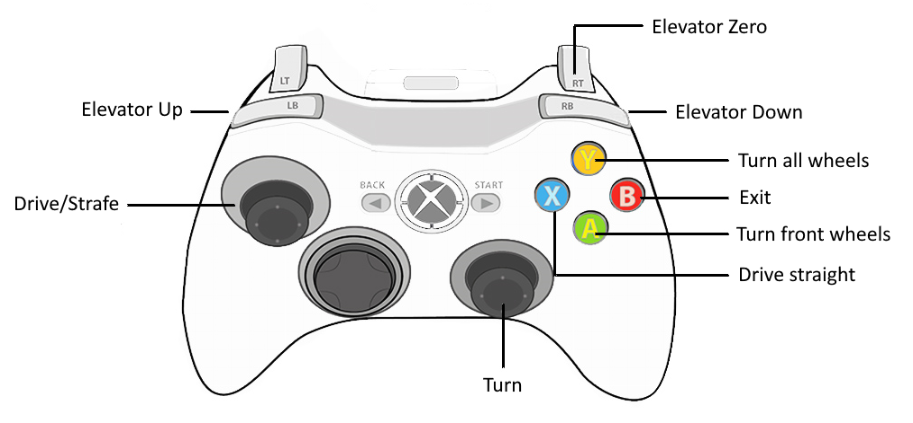

# Wall-Climber

This repository contains the code-base for Sally, a magnetic-wheeled climbing robot for steel structure inspection. Sally can traverse small obstacles, maneuver in confined spaces, and measure surface elemental composition by X-ray fluorescence. By repurposing its steering and sensor deployment mechanisms, the robot is able to transition back and forth between a steel wall and an adjacent steel ceiling, steel wall, or any floor.

## Installation

This code has been tested with ROS2 Jazzy on Ubuntu 24.04. The following setup steps are required prior to installation.

1. Install Ubuntu 24.04 ([tutorial](https://ubuntu.com/tutorials/install-ubuntu-desktop))
2. Install ROS2 Jazzy ([tutorial](https://docs.ros.org/en/iron/Installation.html))
3. Create a colcon workspace ([tutorial](https://docs.ros.org/en/jazzy/Tutorials/Beginner-Client-Libraries/Creating-A-Workspace/Creating-A-Workspace.html))

Once the required setup is complete, run the following commands to clone the repository, install dependencies, and build packages.

```
cd ~/ros2_ws/src
git clone https://github.com/robomechanics/wall-climber.git
pip install -r wall-climber/requirements.txt 
cd ~/ros2_ws
apt-get update
rosdep install --from-paths . --ignore-src -r -y
colcon build --symlink-install
source install/local_setup.bash
```

## Robot Operation

### Robot Setup

1. Plug in a charged 3S battery and turn on the NUC.
2. Connect your computer to the `sally` Wi-Fi hotspot.
3. SSH into the NUC from your computer.
4. Turn on the joystick by holding the middle button.
	- The button light should turn solid once it's paired with the NUC, otherwise you need to press the pairing button on the top.
5. Turn on the motors (red switch).

### Running the Code

The `wc_nopxrf` launch file will run the robot control stack, enabling the operator to drive the robot around, transition between surfaces, and raise and lower the sensor.

```
ros2 launch wall_climber wc_nopxrf.launch.py
```

The `wc_pxrf` launch file will additionally run the portable X-ray fluorescence (pXRF) sensor package, enabling the operator to remotely trigger sensor measurements. However, the `pxrf` package (not publicly available) must already be installed in the colcon workspace.

```
ros2 launch wall_climber wc_pxrf.launch.py
```

### Operator Interface

The robot can be controlled using a joystick or via the keyboard.



| Key   | Command                | Key | Command                             |
| ----- | ---------------------- | --- | ----------------------------------- |
| Space | Stop                   | p   | Terminate the program               |
| w     | Drive forward          | j   | Enter torque mode                   |
| s     | Drive reverse          | k   | Enter velocity mode                 |
| a     | Strafe left            | y   | Turn on force control               |
| d     | Strafe right           | u   | Turn off force control              |
| q     | Turn counter-clockwise | 1   | Turn all wheels forwards            |
| e     | Turn clockwise         | 2   | Turn front wheels sideways          |
| l     | Raise elevator         | 4   | Turn all wheels sideways            |
| ;     | Zero elevator          | f   | Turn front wheels and drive forward |
| '     | Push with elevator     | b   | Turn front wheels and drive reverse |
| r     | Reconnect to motors    |     |                                     |

## Troubleshooting

### The motors don't move and the display says "Can't open port"

- Check that the U2D2 connection to the computer is not loose (the red lights on the U2D2 should turn on when it's plugged in).
- Check that the USB port specified in `main.py` (e.g. `/dev/ttyUSB0`) is the same as the USB port connected to the U2D2. Running `ls /dev/ttyUSB*` will list the potential candidates, and `dmesg | grep tty` will show which devices have been recently connected or disconnected.

### The motors don't move and the display says "No motors"

- Check that the motors are being powered (the red light on the motor should flash when it is first connected to power).
- Check the battery voltage or use a power supply to ensure the motors are receiving 12V.

### The controller is really jerky / the main loop is not running fast enough

- Run the command `echo 1 | sudo tee /sys/bus/usb-serial/devices/ttyUSB0/latency_timer` to reduce the USB latency.
- Set the `Return Delay Time` parameter of the Dynamixel motors to zero.

### The Wi-Fi hotspot does not appear when the NUC turns on

- Check that the NUC has its Wi-Fi hotspot enabled.
- Check that the other Wi-Fi networks have "Connect Automatically" turned off.
- Run `nm-connection-editor` to set the hotspot to start automatically.

### SSH access was denied

- Check that you can ping the NUC's IP address.
- Check that `openssh-server` is installed.
